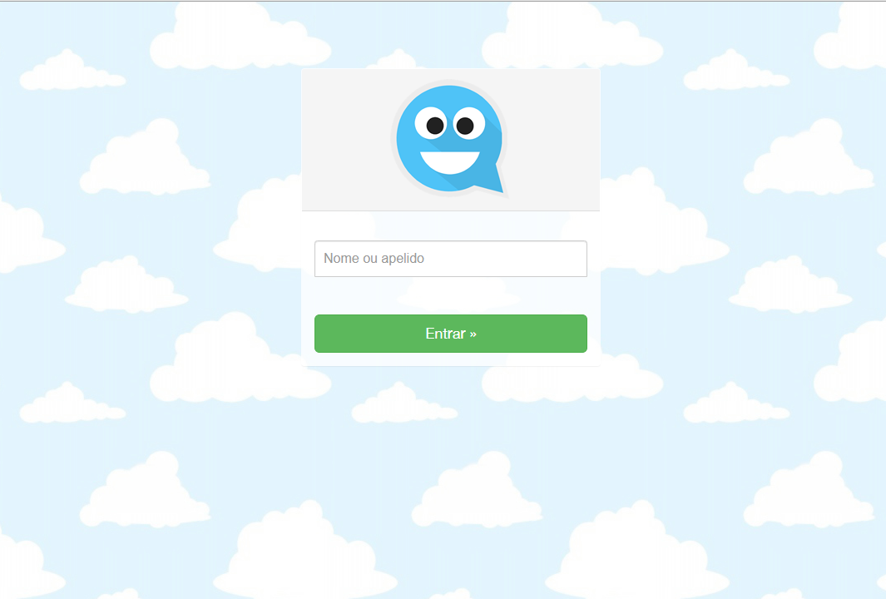
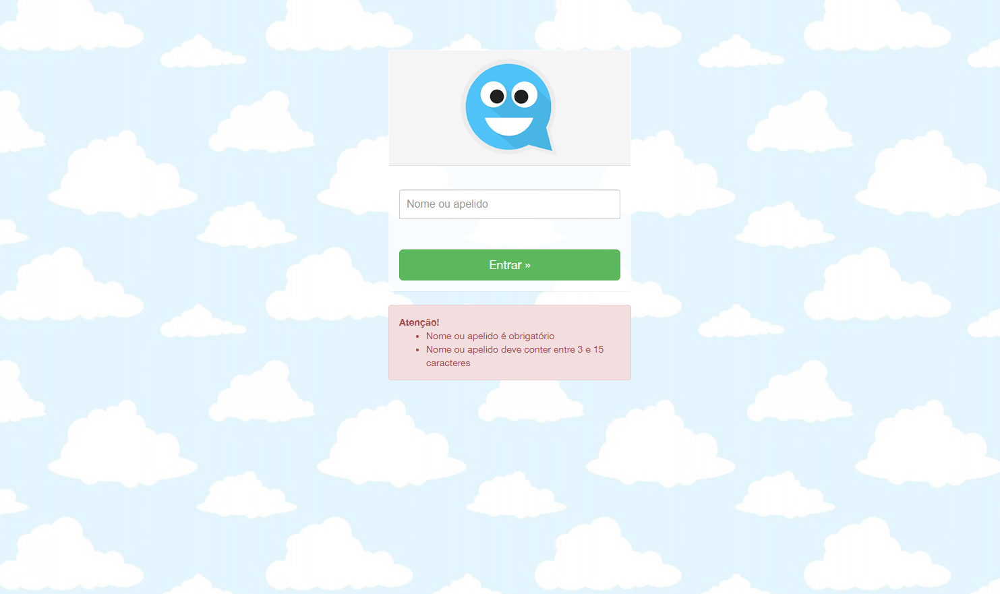
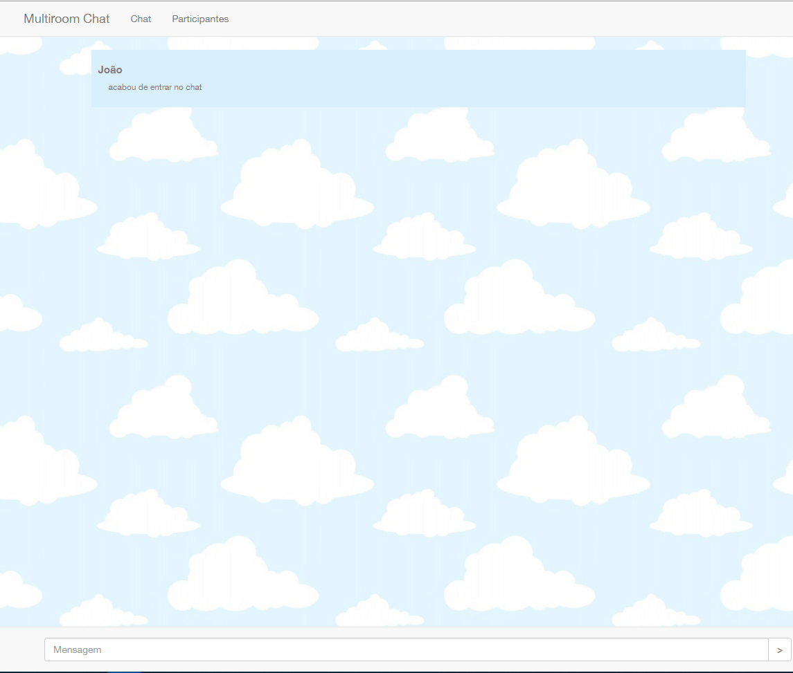
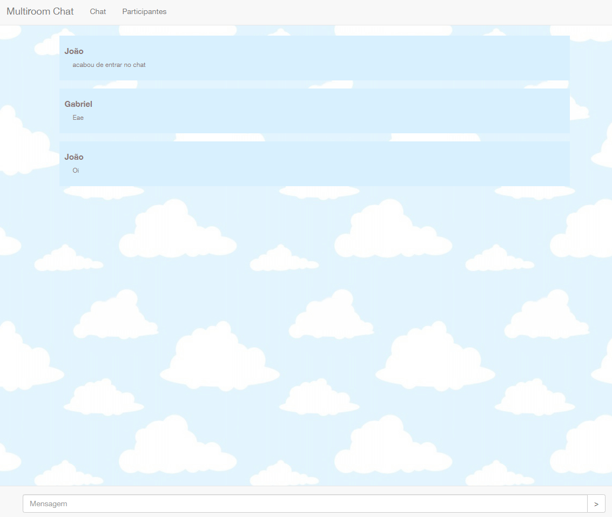
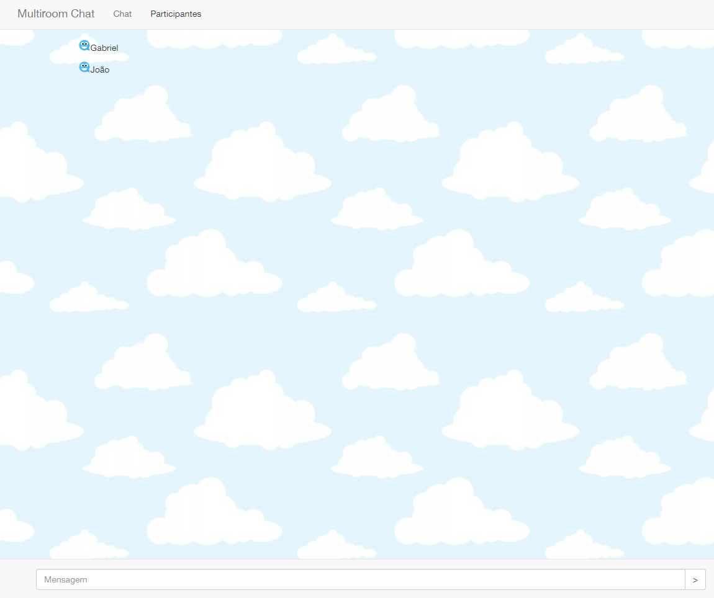

# Multiroom Chat 
desenvolvido no curso https://www.udemy.com/course/curso-completo-do-desenvolvedor-nodejs/

# Tecnologias utilizadas:
 
- NodeJs
- Socket.io
- EJS
- Body-parser
- Express-validator
- Express
- JS
- MVC
- HTML
- CSS
- JS

# Requisitos:

- NodeJs
- npm
- git

# Para executar:

`git clone https://github.com/giraudgabriel/Multiroom-Chat.git`
 
 
`npm install`
 
 
`nodemon app`
 
 
<b>E acessar a url https://localhost</b>

# Tela Inicial

# Validação dos dados

# Chat quando alguém entra

# Mensagens

# Participantes

